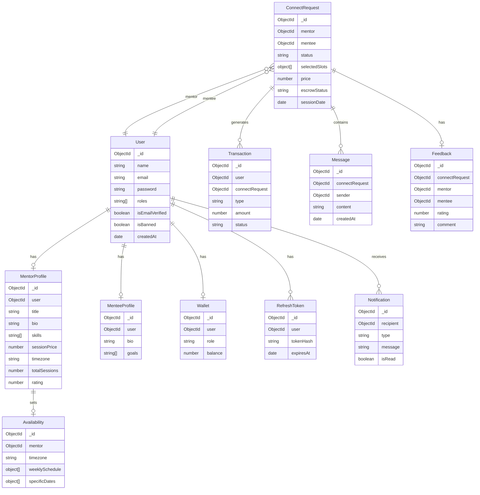

# LeapMentor — Data Model

## Entity Relationship Diagram

```mermaid
erDiagram
    User {
        ObjectId _id
        string name
        string email
        string password
        string[] roles
        boolean isEmailVerified
        boolean isBanned
        date createdAt
    }
    MentorProfile {
        ObjectId _id
        ObjectId user
        string title
        string bio
        string[] skills
        number sessionPrice
        string timezone
        number totalSessions
        number rating
    }
    MenteeProfile {
        ObjectId _id
        ObjectId user
        string bio
        string[] goals
    }
    Availability {
        ObjectId _id
        ObjectId mentor
        string timezone
        object[] weeklySchedule
        object[] specificDates
    }
    ConnectRequest {
        ObjectId _id
        ObjectId mentor
        ObjectId mentee
        string status
        object[] selectedSlots
        number price
        string escrowStatus
        date sessionDate
    }
    Transaction {
        ObjectId _id
        ObjectId user
        ObjectId connectRequest
        string type
        number amount
        string status
    }
    Wallet {
        ObjectId _id
        ObjectId user
        string role
        number balance
    }
    RefreshToken {
        ObjectId _id
        ObjectId user
        string tokenHash
        date expiresAt
    }
    Message {
        ObjectId _id
        ObjectId connectRequest
        ObjectId sender
        string content
        date createdAt
    }
    Notification {
        ObjectId _id
        ObjectId recipient
        string type
        string message
        boolean isRead
    }
    Feedback {
        ObjectId _id
        ObjectId connectRequest
        ObjectId mentor
        ObjectId mentee
        number rating
        string comment
    }

    User ||--o| MentorProfile : "has"
    User ||--o| MenteeProfile : "has"
    User ||--o| Wallet : "has"
    User ||--o{ RefreshToken : "has"
    MentorProfile ||--o| Availability : "sets"
    ConnectRequest }o--|| User : "mentor"
    ConnectRequest }o--|| User : "mentee"
    ConnectRequest ||--o{ Transaction : "generates"
    ConnectRequest ||--o{ Message : "contains"
    ConnectRequest ||--o| Feedback : "has"
    User ||--o{ Notification : "receives"
```