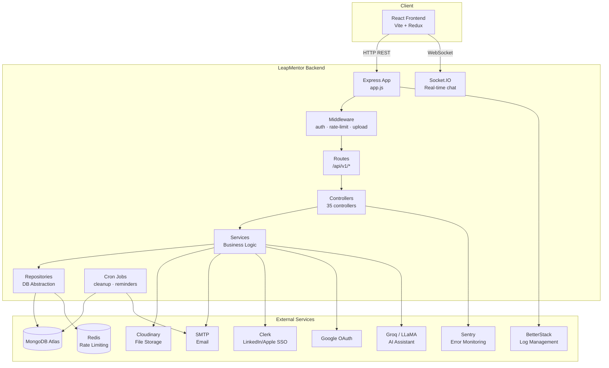
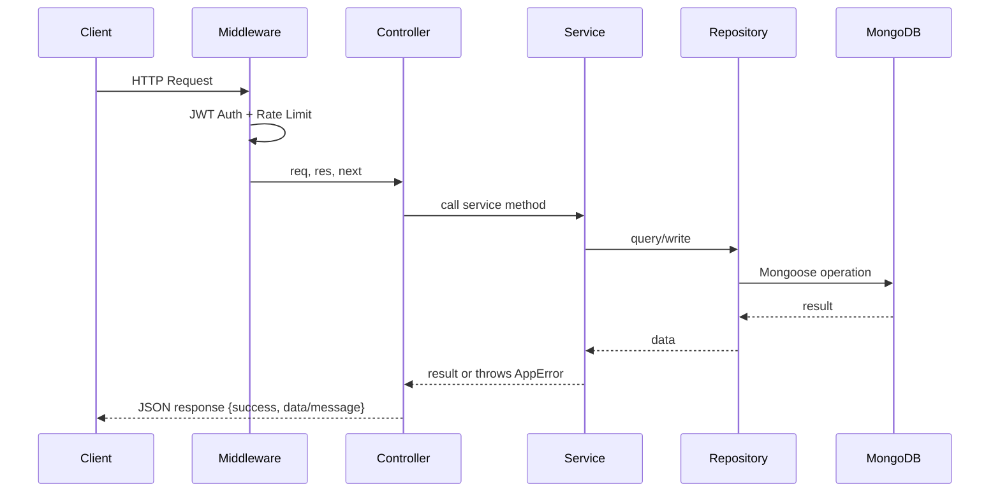
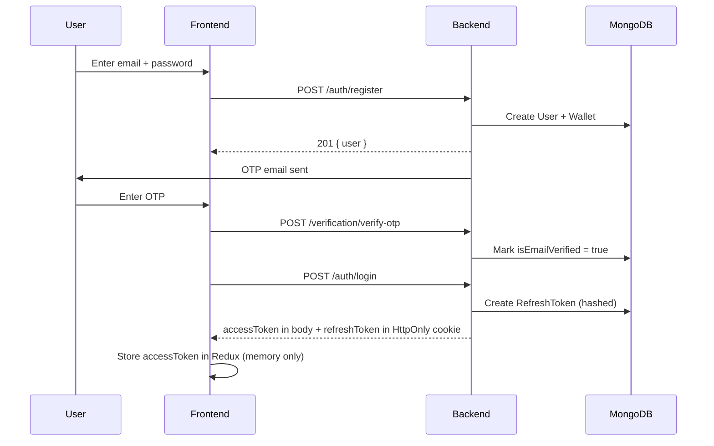
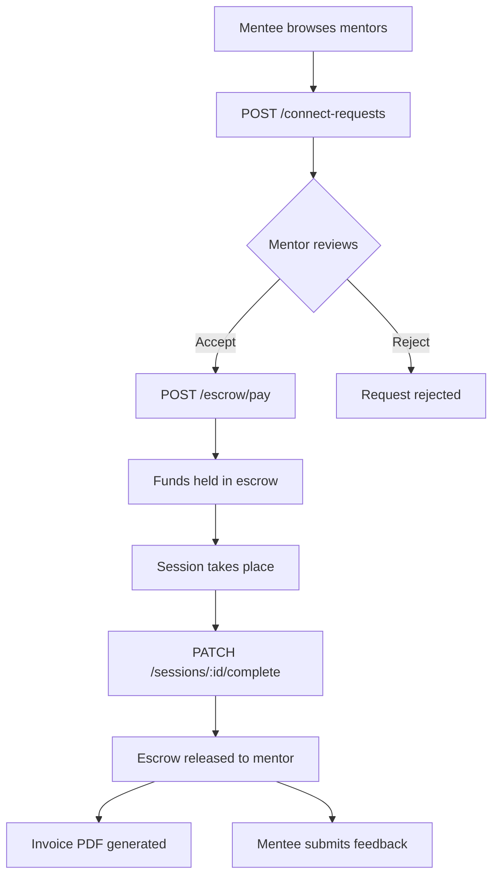
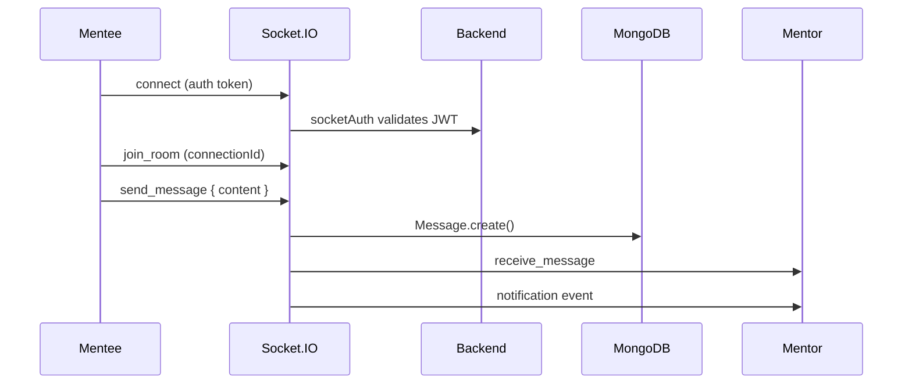
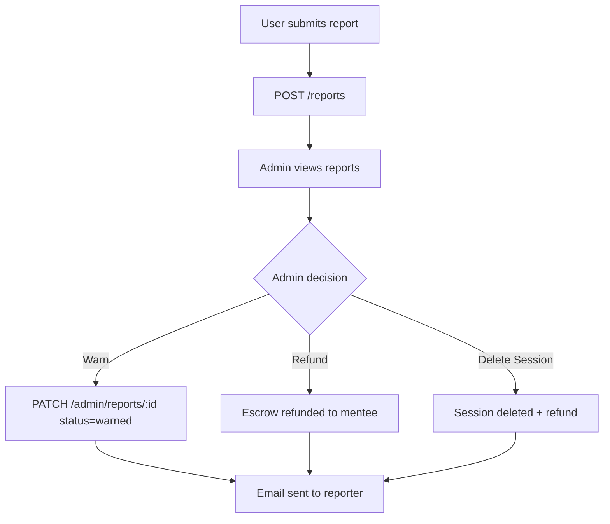
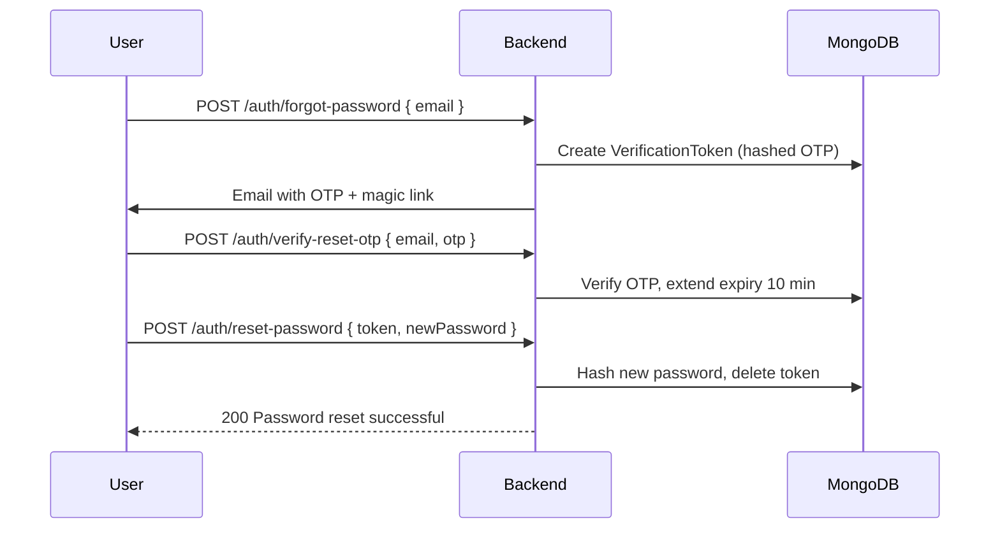

# LeapMentor Backend

LeapMentor mentorship platform — connecting mentees with industry expert mentors.


## Table of Contents

- [Overview](#overview)
- [Tech Stack](#tech-stack)
- [Project Structure](#project-structure)
- [Getting Started](#getting-started)
- [Environment Variables](#environment-variables)
- [API Routes](#api-routes)
- [Authentication Flows](#authentication-flows)
- [Real-time (Socket.IO)](#real-time-socketio)
- [Cron Jobs](#cron-jobs)
- [Testing](#testing)
- [Deployment](#deployment)

---

## Overview

LeapMentor's backend handles:

- JWT-based auth with Google OAuth and Clerk SSO (LinkedIn, Apple)
- Mentor/mentee onboarding and profile management
- Slot-based availability and booking with TTL-backed slot locking
- Real-time chat via Socket.IO
- Session lifecycle, feedback, goals, and notes
- Escrow-based payment flow with earnings tracking
- Admin panel with user management, reports, and platform settings

---

## Tech Stack

| Layer | Technology |
|-------|-----------|
| Runtime | Node.js 18+ |
| Framework | Express 5 |
| Database | MongoDB + Mongoose 9 |
| Real-time | Socket.IO 4 |
| Auth | JWT + Google OAuth + Clerk |
| Email | Nodemailer (SMTP) |
| File Uploads | Cloudinary + Multer |
| Push Notifications | Web Push (VAPID) |
| PDF Generation | PDFKit |
| Scheduling | node-cron |
| Testing | Jest + Supertest + mongodb-memory-server |
| Deployment | Render |

---
## Dependencies

Install with `npm install`. Key production packages:

| Package | Version | Purpose |
|---|---|---|
| `express` | ^5.2.1 | HTTP framework |
| `mongoose` | ^9.2.1 | MongoDB ODM |
| `socket.io` | ^4.8.3 | Real-time WebSocket server |
| `jsonwebtoken` | ^9.0.3 | JWT signing and verification |
| `bcryptjs` | ^3.0.3 | Password hashing |
| `@clerk/backend` | ^3.0.1 | Clerk SSO (LinkedIn, Apple) |
| `google-auth-library` | ^10.5.0 | Google OAuth verification |
| `ioredis` | ^5.11.0 | Redis client — required for rate limiting |
| `cloudinary` | ^2.9.0 | File upload and storage |
| `multer` | ^2.2.0 | Multipart form data (file uploads) |
| `nodemailer` | ^9.0.1 | SMTP email sending |
| `pdfkit` | ^0.17.2 | Invoice PDF generation |
| `helmet` | ^8.2.0 | HTTP security headers |
| `express-rate-limit` | ^8.5.2 | API rate limiting |
| `@sentry/node` | ^10.53.1 | Error monitoring |
| `@logtail/winston` | ^0.5.8 | BetterStack log transport |
| `winston` | ^3.19.0 | Logging framework |
| `node-cron` | ^4.2.1 | Scheduled jobs |

Dev dependencies: `jest`, `supertest`, `mongodb-memory-server`, `nodemon`

## Project Structure

```
├── app.js                  # Express setup — middleware, routes, CORS
├── server.js               # Entry point — HTTP server + Socket.IO
├── config/
│   ├── db.js               # MongoDB connection
│   └── cloudinary.js       # Cloudinary config
├── controllers/            # Route handler logic (one file per feature)
│   └── admin/              # Admin-specific controllers
├── models/                 # Mongoose schemas
├── routes/                 # Express route definitions
├── middleware/
│   ├── authenticate.js     # JWT auth guard
│   ├── adminAuth.js        # Admin role guard
│   ├── auth.middleware.js  # Role-based access (requireRole)
│   ├── noteAccess.js       # Note ownership check
│   └── upload.middleware.js# Multer + Cloudinary upload
├── socket/
│   ├── socketAuth.js       # Socket.IO JWT middleware
│   └── socketHandler.js    # Real-time event handlers
├── services/               # Business logic layer
├── repositories/           # DB query abstraction
├── utils/                  # Helpers — tokens, slots, emails, invoices, push
├── cron/                   # Scheduled jobs
├── scripts/                # One-time seed scripts
└── __tests__/              # Jest test suites
```

---
## Architecture

### System Architecture



### Request Flow


## Workflow
### Authentication Flow:


### Session Booking Flow


### Real-time Chat Flow:


###  Admin Report Resolution:


###  Password Reset Flow:


## Getting Started

### Prerequisites

- Node.js v18+
- MongoDB Atlas URI (or local MongoDB)
- `.env` file (see [Environment Variables](#environment-variables))

### Install & Run

```bash
# Clone the repo
git clone https://github.com/your-org/leapmentor-backend.git
cd leapmentor-backend

# Install dependencies
npm install

# Development (with nodemon)
npm run dev

# Production
npm start
```

### Seed Scripts

Run these once after first setup:

```bash
# Create the first admin user
node scripts/seedAdmin.js

# Set platform commission rate
node scripts/seedPlatformCommission.js
```

---

## Environment Variables

Create a `.env` file in the root:

```env
# Server
PORT=5000
NODE_ENV=development

# MongoDB
MONGO_URI=mongodb+srv://<user>:<pass>@cluster.mongodb.net/leapmentor

# JWT
JWT_SECRET=your_jwt_secret_here

# Google OAuth
GOOGLE_CLIENT_ID=your_google_client_id
GOOGLE_CLIENT_SECRET=your_google_client_secret

# Clerk SSO
CLERK_SECRET_KEY=your_clerk_secret_key

# Frontend URLs
APP_BASE_URL=http://localhost:5173
CLIENT_URL=http://localhost:5173

# SMTP (Email)
SMTP_HOST=smtp.yourprovider.com
SMTP_PORT=587
SMTP_USER=your@email.com
SMTP_PASS=yourpassword
FROM_EMAIL=noreply@leapmentor.com

# Cloudinary
CLOUDINARY_CLOUD_NAME=your_cloud_name
CLOUDINARY_API_KEY=your_api_key
CLOUDINARY_API_SECRET=your_api_secret

# Web Push (VAPID)
VAPID_PUBLIC_KEY=your_vapid_public_key
VAPID_PRIVATE_KEY=your_vapid_private_key
VAPID_EMAIL=mailto:your@email.com
```

---

## API Routes

All routes are prefixed with `/api/v1`.  
Protected routes require the header: `Authorization: Bearer <token>`

### Auth — `/auth`

| Method | Endpoint | Auth | Description |
|--------|----------|------|-------------|
| POST | `/auth/register` | No | Register with email + password |
| POST | `/auth/login` | No | Login, returns JWT |
| POST | `/auth/google` | No | Google OAuth login/register |
| GET | `/auth/google/callback` | No | Google OAuth callback |
| POST | `/auth/clerk-sso` | No | Clerk SSO (LinkedIn, Apple) |
| POST | `/auth/forgot-password` | No | Send password reset email |
| POST | `/auth/reset-password` | No | Reset password with token |
| POST | `/auth/change-password` | Yes | Change password (logged in) |

### Verification — `/verification`

| Method | Endpoint | Auth | Description |
|--------|----------|------|-------------|
| POST | `/verification/send` | No | Send OTP + magic link |
| POST | `/verification/resend` | No | Resend verification email |
| POST | `/verification/verify-otp` | No | Verify OTP code |
| GET | `/verification/verify-link/:token` | No | Verify via magic link |

### Users — `/users`

| Method | Endpoint | Auth | Description |
|--------|----------|------|-------------|
| GET | `/users/me` | Yes | Get logged-in user info |

### Mentor Profile — `/mentor-profile`

| Method | Endpoint | Auth | Description |
|--------|----------|------|-------------|
| POST | `/mentor-profile` | Mentor | Create profile (onboarding) |
| GET | `/mentor-profile/me` | Mentor | Get own profile |
| PUT | `/mentor-profile/me` | Mentor | Update own profile |
| GET | `/mentor-profile/:id` | No | Get public profile by userId |

### Mentee Profile — `/mentee-profile`

| Method | Endpoint | Auth | Description |
|--------|----------|------|-------------|
| POST | `/mentee-profile` | Mentee | Create profile (onboarding) |
| GET | `/mentee-profile/me` | Mentee | Get own profile |
| PUT | `/mentee-profile/me` | Mentee | Update own profile |
| GET | `/mentee-profile/:id` | No | Get public profile |

### Mentor Search — `/mentor-search`

| Method | Endpoint | Auth | Description |
|--------|----------|------|-------------|
| GET | `/mentor-search` | Yes | Search mentors with filters + pagination |

### Availability — `/availability`

| Method | Endpoint | Auth | Description |
|--------|----------|------|-------------|
| GET | `/availability/me` | Mentor | Get own availability |
| POST | `/availability` | Mentor | Create availability |
| PATCH | `/availability/me` | Mentor | Update availability |
| DELETE | `/availability/me` | Mentor | Clear availability |
| GET | `/availability/:mentorId` | No | Get mentor availability (public) |
| GET | `/availability/:mentorId/slots?duration=60` | Yes | Get bookable slots |

### Connect Requests — `/connect-request`

| Method | Endpoint | Auth | Description |
|--------|----------|------|-------------|
| POST | `/connect-request` | Mentee | Send connect request |
| GET | `/connect-request/mentor` | Mentor | Get all received requests |
| GET | `/connect-request/mentee` | Mentee | Get all sent requests |
| PATCH | `/connect-request/:id/accept` | Mentor | Accept a request |
| PATCH | `/connect-request/:id/reject` | Mentor | Reject a request |
| PATCH | `/connect-request/:id/cancel` | Mentee | Cancel a request |
| GET | `/connect-request/:id` | Yes | Get single request details |

### Sessions — `/sessions`

| Method | Endpoint | Auth | Description |
|--------|----------|------|-------------|
| GET | `/sessions` | Yes | Get sessions for logged-in user |
| GET | `/sessions/:id` | Yes | Get single session details |
| PATCH | `/sessions/:id/complete` | Mentor | Mark session as complete |
| PATCH | `/sessions/:id/cancel` | Yes | Cancel a session |

### Messages — `/messages`

| Method | Endpoint | Auth | Description |
|--------|----------|------|-------------|
| GET | `/messages/:connectionId` | Yes | Get chat history |
| POST | `/messages/:connectionId` | Yes | Send message (REST fallback) |

### Notifications — `/notifications`

| Method | Endpoint | Auth | Description |
|--------|----------|------|-------------|
| GET | `/notifications` | Yes | Get all notifications |
| PATCH | `/notifications/:id/read` | Yes | Mark one as read |
| PATCH | `/notifications/read-all` | Yes | Mark all as read |

### Push — `/push`

| Method | Endpoint | Auth | Description |
|--------|----------|------|-------------|
| POST | `/push/subscribe` | Yes | Save push subscription |
| DELETE | `/push/unsubscribe` | Yes | Remove push subscription |

### Feedback — `/feedback`

| Method | Endpoint | Auth | Description |
|--------|----------|------|-------------|
| POST | `/feedback` | Mentee | Submit session feedback |
| GET | `/feedback/mentor/:mentorId` | No | Get mentor's public feedback |

### Goals — `/goals`

| Method | Endpoint | Auth | Description |
|--------|----------|------|-------------|
| POST | `/goals` | Yes | Create a goal |
| GET | `/goals` | Yes | Get own goals |
| PATCH | `/goals/:id` | Yes | Update a goal |
| DELETE | `/goals/:id` | Yes | Delete a goal |

### Notes — `/notes` + `/private-notes`

| Method | Endpoint | Auth | Description |
|--------|----------|------|-------------|
| POST | `/notes` | Yes | Create a shared note |
| GET | `/notes/:connectionId` | Yes | Get notes for a connection |
| PATCH | `/notes/:id` | Yes | Update a note |
| DELETE | `/notes/:id` | Yes | Delete a note |
| POST | `/private-notes` | Yes | Create a private note |
| GET | `/private-notes` | Yes | Get own private notes |

### Earnings — `/earnings`

| Method | Endpoint | Auth | Description |
|--------|----------|------|-------------|
| GET | `/earnings` | Mentor | Get earnings summary + transactions |

### Reports — `/reports`

| Method | Endpoint | Auth | Description |
|--------|----------|------|-------------|
| POST | `/reports` | Yes | Submit a report |
| GET | `/reports/me` | Yes | Get own submitted reports |

### Admin — `/admin`

| Method | Endpoint | Auth | Description |
|--------|----------|------|-------------|
| POST | `/admin/login` | No | Admin login |
| GET | `/admin/users` | Admin | List all users |
| PATCH | `/admin/users/:id/ban` | Admin | Ban a user |
| GET | `/admin/reports` | Admin | View all reports |
| PATCH | `/admin/reports/:id` | Admin | Update report status |
| GET | `/admin/payments` | Admin | View all transactions |
| GET | `/admin/settings` | Admin | Get platform settings |
| PATCH | `/admin/settings` | Admin | Update platform settings |

---

## Authentication Flows

### Email / Password
1. `POST /auth/register` → creates user, sends OTP + magic link to email
2. User verifies via OTP or magic link → `isEmailVerified = true`
3. `POST /auth/login` → returns JWT
4. All protected routes expect: `Authorization: Bearer <token>`

### Google OAuth
1. Frontend renders Google button via GSI (Google Sign-In library)
2. On click, Google returns a `credential` (signed JWT)
3. Frontend POSTs credential to `POST /auth/google`
4. Backend verifies with `google-auth-library`, creates/finds user, returns JWT

### Clerk SSO (LinkedIn / Apple)
1. Frontend triggers Clerk's `authenticateWithRedirect`
2. After auth, Clerk redirects to `/sso-callback`
3. Backend exchanges Clerk session for internal JWT
4. Role and terms acceptance stored in `localStorage` before redirect

---

## Real-time (Socket.IO)

Socket.IO runs on the same HTTP server as Express. Auth is handled by `socketAuth.js` which validates the JWT passed in `socket.handshake.auth.token`.

### Key Events

| Event | Direction | Description |
|-------|-----------|-------------|
| `join_room` | Client → Server | Join a chat room by `connectionId` |
| `send_message` | Client → Server | Send a chat message |
| `receive_message` | Server → Client | Receive a new message |
| `notification` | Server → Client | Real-time notification push |
| `disconnect` | Client → Server | Auto-cleanup on disconnect |

---

## Cron Jobs

| File | Schedule | Description |
|------|----------|-------------|
| `cleanupAvailability.js` | Nightly (midnight) | Removes past specific dates from mentor availability |
| `sessionReminders.js` | Every hour | Sends push + email reminders for upcoming sessions |

---
## Debug Tools

### API Debugging
| Tool | Purpose |
|------|---------|
| [REST Client](https://marketplace.visualstudio.com/items?itemName=humao.rest-client) | VSCode extension — run HTTP requests from `.http` files directly in editor |
| [MongoDB for VS Code](https://marketplace.visualstudio.com/items?itemName=mongodb.mongodb-vscode) | Browse collections and run queries without leaving VSCode |
| Postman | Full API testing — collection exported at `docs/LeapMentor.postman_collection.json` |
| Sentry Dashboard | Runtime error monitoring at `https://sentry.io` — configured via `SENTRY_DSN` env var |
| Winston + BetterStack | Structured logs viewable at BetterStack dashboard — configured via `LOGTAIL_TOKEN` |

### Backend Local Debugging
- Use `nodemon` (`npm run dev`) — auto-restarts on every file save
- Add `--inspect` flag for Chrome DevTools: `node --inspect server.js`
- VSCode launch config is at `.vscode/launch.json` (see below)
## Testing

```bash
# Run all tests
npm test

# With coverage report
npm run test:coverage

# Watch mode
npm run test:watch
```

Test suites in `__tests__/`:

- `auth.test.js` — register, login, token validation
- `availability.test.js` — create, update, slot generation
- `escrow.test.js` — payment hold and release logic
- `session.test.js` — session lifecycle

Tests use `mongodb-memory-server` so no real DB connection is needed.

---

## Deployment

Deployed on **Render**.

1. Connect your GitHub repo to Render
2. Set all `.env` variables in Render dashboard → **Environment**
3. Set **Start Command** to: `node server.js`
4. After deploy, add your Render backend URL to:
   - Google Cloud Console → **Authorized redirect URIs**
   - Google Cloud Console → **Authorized JavaScript origins** (frontend URL)


